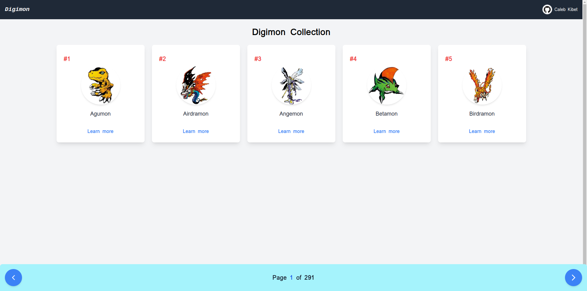
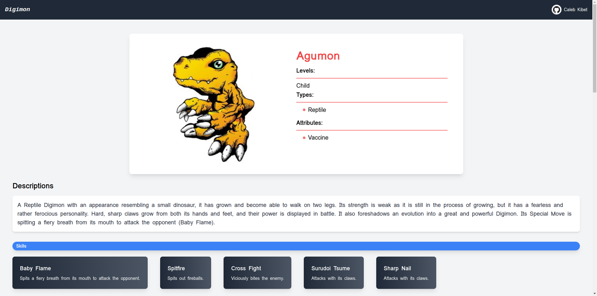

# Digimon Gallery
A simple React application that displays a gallery of Digimons. The application fetches data from the Digimon API allowing users to browse through various Digimons with pagination functionality and view detailed information about each Digimon including their levels, types, attributes, skills and evolutions.

## Features
**Display Digimons:** Shows a list of Digimons with their images, names and IDs.
**Pagination:** Navigate through the Digimon gallery with previous and next buttons.
**Digimon Details:** View detailed information about individual Digimons such as their levels, types, attributes, skills and prior evolutions.

## Technologies Used
**Next:** For building the user interface.
**Axios:** For making API calls to fetch Digimon data.
**React Router:** For navigation between the Digimon gallery and Digimon detail pages.
**React Icons:** For using icons in the navigation buttons.
**Tailwind CSS:** For styling and responsive design.

## Getting Started
### Prerequisites
Ensure you have the following installed on your machine:

**Node.js:** You can download it from nodejs.org.

## Installation
1. Clone the repository:
```bash
git clone https://github.com/Caleb-ne1/digimon-api-gallery.git
```

2. Navigate into the project directory:

```bash
cd digimon-api-gallery
```

3. Install dependencies:

```bash
npm install
```

4. Running the Application To start the application, run:

```bash
npm run dev
```
This command will launch the app in your default web browser. By default, it should be accessible at http://localhost:3000.

## How to Use
Gallery View
* Use the Previous and Next buttons to navigate through the pages.
* Each Digimon displays its ID, name and image.
* Click on a learn more to view more detailed information.

Detail View:
The detailed page shows the following information:
* Levels: Displays the levels of the Digimon (if available).
* Types: Shows the different types of the Digimon.
* Attributes: Displays the Digimon's attributes.
* Skills: Lists the Digimon's skills along with descriptions.
* Prior Evolutions: Displays any prior evolutions of the Digimon with images and conditions.

## API Reference
The application fetches data from the following API endpoints:

Digimon API: https://digi-api.com/api/v1/digimon
